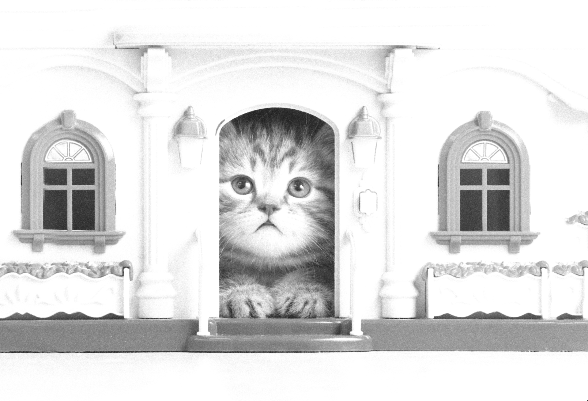
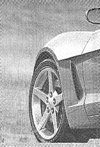

# Image Restoration (Spatial & Frequency Domain Filtering)

Developed and applied advanced image restoration techniques in MATLAB to remove multiple types of noise from corrupted images, using both spatial and frequency domain approaches.

This project was built **entirely from scratch** without using any high-level MATLAB "Image Processing Toolbox" functions (e.g., `conv2`, `medfilt2`, `wiener2`), as required by the project specification. All filtering operations, including convolution and Fourier transforms, were implemented from first principles.

---

## 🚀 Project Methodology

The core task was to analyze three differently corrupted images, correctly diagnose the noise type, and then design and apply the appropriate restoration filter (either spatial or frequency-domain) to recover the original image.

### 1. Noise Diagnosis
* **Spatial Analysis:** Used **Histogram Analysis** (`imhist`) to identify impulse noise (e.g., "salt and pepper"), which appears as distinct spikes at 0 and 255 intensity.
* **Frequency Analysis:** Used **Discrete Fourier Transform (DFT)** visualization to identify periodic noise, which manifests as bright, star-like artifacts in the frequency spectrum.

### 2. Spatial Domain Restoration (from Scratch)
* **Target:** `noisy1.png` and `noisy2.png` (additive impulse/Gaussian noise).
* **Implementation:** Developed custom functions to manually perform 2D convolution by iterating a filter mask (kernel) over every pixel of the image.
* **Filters Implemented:**
    * **Median Filter:** Highly effective for removing impulse ("salt and pepper") noise by replacing each pixel with the median value of its neighborhood.
    * **Contraharmonic Mean Filter:** A flexible filter for removing specific types of impulse noise (salt *or* pepper) based on its order parameter `Q`.
    * **Averaging Filters:** Used for smoothing out Gaussian noise.

### 3. Frequency Domain Restoration (from Scratch)
* **Target:** `noisy3.tif` (periodic sinusoidal noise).
* **Implementation:** Built a complete frequency-domain filtering pipeline:
    1.  **Transform:** Compute the 2D DFT of the noisy image (e.g., via `fft2`) and shift the zero-frequency component to the center (`fftshift`).
    2.  **Filter Design:** Manually created a 2D filter mask in the frequency domain. A **Notch Filter** (or Band-Reject filter) was designed to precisely target and zero-out the bright spots in the spectrum corresponding to the periodic noise.
    3.  **Apply Filter:** Multiply the image's spectrum by the filter mask.
    4.  **Inverse Transform:** Unshift the spectrum (`ifftshift`) and apply the Inverse DFT (`ifft2`) to reconstruct the final, restored image.

---

## 📊 Key Results: Before & After

### Restoration 1: Spatial Filtering (Impulse Noise)
| Before (`noisy1.png`) | After (`recovered1.png`) |
| :---: | :---: |
|  |  |

### Restoration 2: Spatial Filtering (Additive Noise)
| Before (`noisy2.png`) | After (`recovered2.png`) |
| :---: | :---: |
|  |  |

### Restoration 3: Frequency Filtering (Periodic Noise)
| Before (`noisy3.tif`) | After (`recovered3.png`) |
| :---: | :---: |
|  |  |

---

## 🚀 How to Run

1.  Open MATLAB.
2.  Place the noisy images (`noisy1.png`, `noisy2.png`, `noisy3.tif`) in the same directory as the `.m` script.
3.  Open and run the main script (`A2_StudentID.m`).
4.  The script will process all three images in sequence, displaying the results and saving them to `recovered1.png`, `recovered2.png`, and `recovered3.png` in the same directory.